# 🍔 FoodyMind – Online Food Ordering Application

<p align="center">
  
</p>

<p align="center">


</p>

---

# 📱 About The Project

**FoodyMind** is an Android-based **Online Food Ordering Application** developed using **Kotlin** and **MVVM Architecture**.

The application enables users to browse food items, search meals, add products to cart, place orders, manage profiles, and view order history. All data is managed using **Firebase Authentication**, **Firebase Realtime Database**, and **Firebase Storage**.

The project is designed with a clean architecture and scalable code structure, making it suitable for both **academic projects** and **professional portfolios**.

---

# ✨ Features

## 👤 User Authentication

- Email & Password Login
- User Registration
- Google Sign-In
- Forgot Password

---

## 🍽 Food Ordering

- Browse Food Menu
- Popular Items
- View Food Details
- Search Food
- Add to Cart

---

## 🛒 Cart Management

- Increase Quantity
- Decrease Quantity
- Delete Item
- Smart Add to Cart
- Total Amount Calculation

---

## 📦 Order System

- Checkout
- Place Order
- Order Confirmation
- Order History
- Buy Again Feature

---

## 👤 User Profile

- Update Profile
- Save Information
- Logout

---

# 🏗 Architecture

The project follows **MVVM (Model-View-ViewModel)** Architecture.

```
                View
        (Activity / Fragment)
                    │
                    │
                    ▼
              ViewModel
                    │
                    │
                    ▼
               Repository
                    │
                    │
                    ▼
      Firebase Realtime Database
                    │
                    │
        ┌───────────┴───────────┐
        │                       │
        ▼                       ▼
Firebase Authentication   Firebase Storage
```

---

# 🔥 Firebase Services Used

## ✅ Firebase Authentication

- Email Login
- Password Login
- Google Sign-In

---

## ✅ Firebase Realtime Database

- User Data
- Menu Items
- Cart Data
- Orders
- Order History

---

## ✅ Firebase Storage

- Food Images
- Image Management

---

# 🛠 Tech Stack

| Technology | Used |
|------------|------|
| Language | Kotlin |
| Architecture | MVVM |
| IDE | Android Studio |
| Database | Firebase Realtime Database |
| Authentication | Firebase Authentication |
| Storage | Firebase Storage |
| UI | XML |
| Image Loading | Glide |
| Version Control | Git |
| Repository | GitHub |

---

# 📂 Project Structure

```
com.example.foodymind

│

├── Adapter

├── Fragment

├── Model

├── Repository

├── ViewModel

│

├── LoginActivity

├── MainActivity

├── DetailActivity

├── PayOutActivity

│

└── Firebase Services
```

---

# 📦 Libraries & Dependencies

```gradle
implementation "com.google.firebase:firebase-auth"

implementation "com.google.firebase:firebase-database"

implementation "com.google.firebase:firebase-storage"

implementation "com.github.bumptech.glide:glide"

implementation "com.google.android.gms:play-services-auth"

implementation "androidx.recyclerview:recyclerview"

implementation "androidx.lifecycle:lifecycle-viewmodel-ktx"

implementation "androidx.lifecycle:lifecycle-livedata-ktx"

implementation "androidx.navigation:navigation-fragment-ktx"

implementation "androidx.navigation:navigation-ui-ktx"
```

---

# ⭐ Special Functionalities

- ✅ MVVM Architecture
- ✅ Firebase Integration
- ✅ Google Authentication
- ✅ Dynamic Food Menu
- ✅ Smart Cart System
- ✅ Quantity Management
- ✅ Real-Time Order Management
- ✅ Buy Again Feature
- ✅ Profile Management
---

# 📸 Application Screenshots

## 🚀 Splash Screen

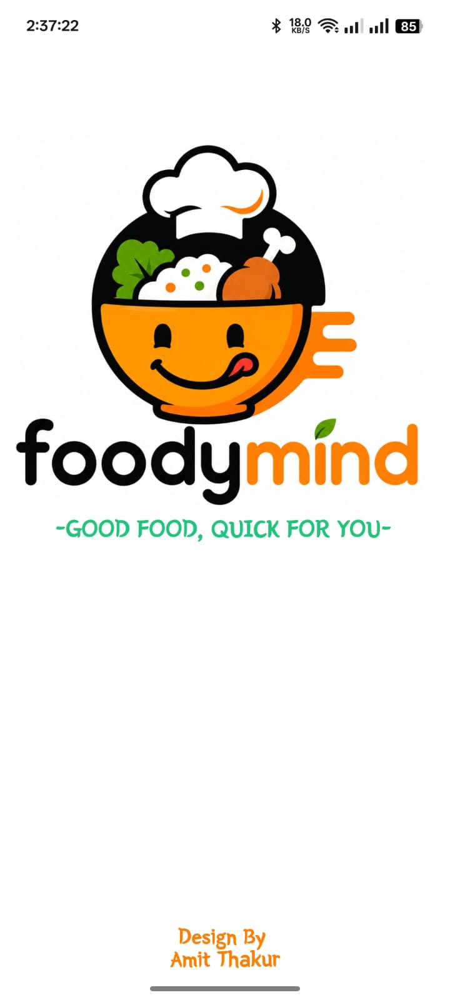

---

## 👋 Welcome Screen


---

## 🔐 Login Screen

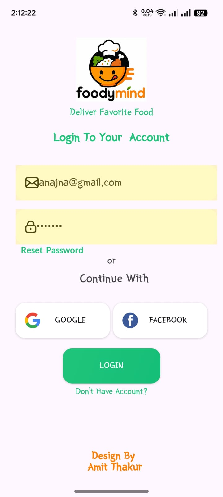

---

## 🔑 Google Sign-In


---

## 📝 Sign Up Screen


---

## 🏠 Home Screen

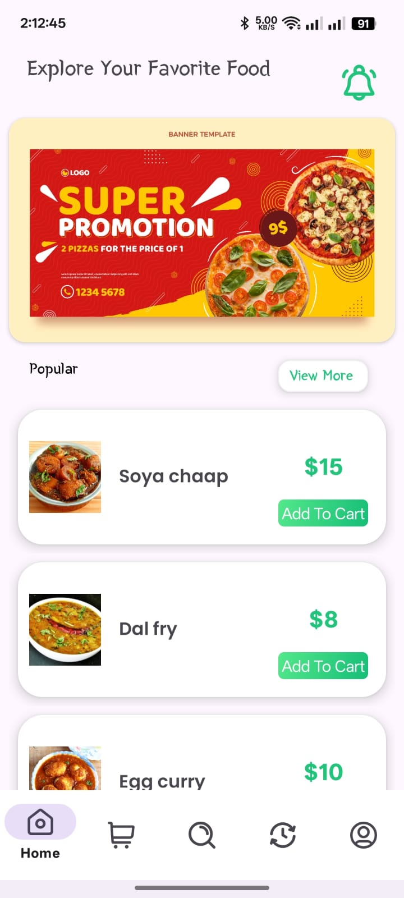

---

## 🍽 Menu Screen

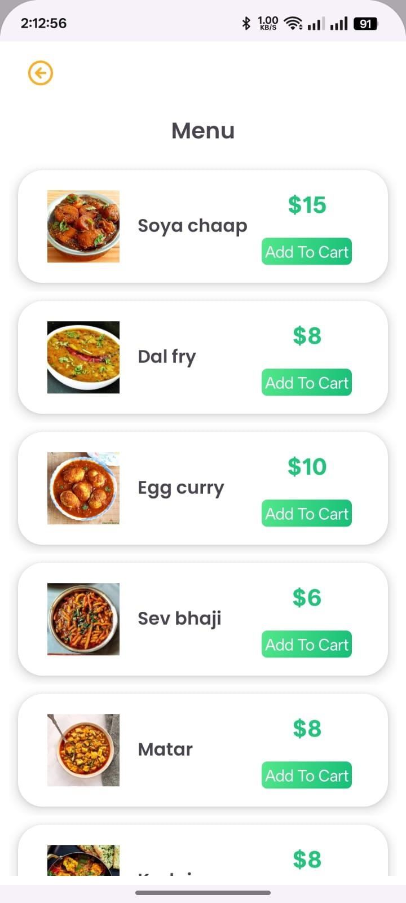

---

## 🔍 Search Screen

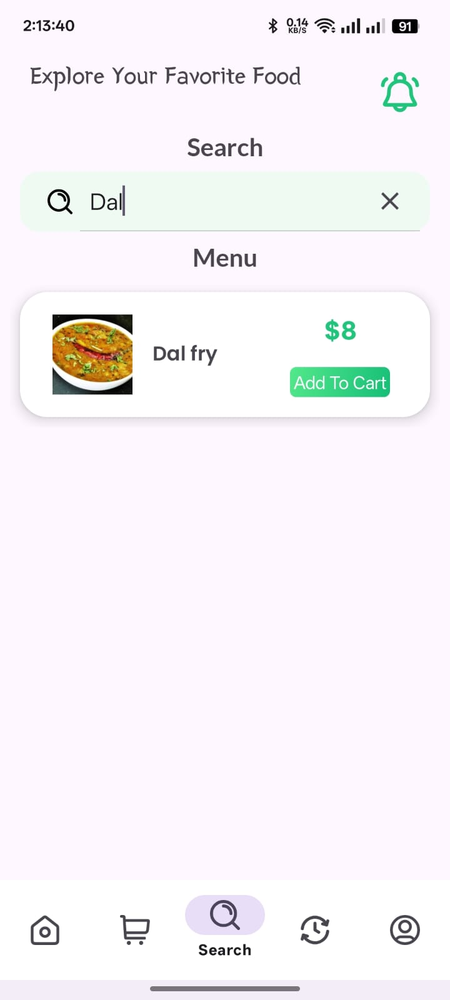

---

## 🛒 Cart Screen

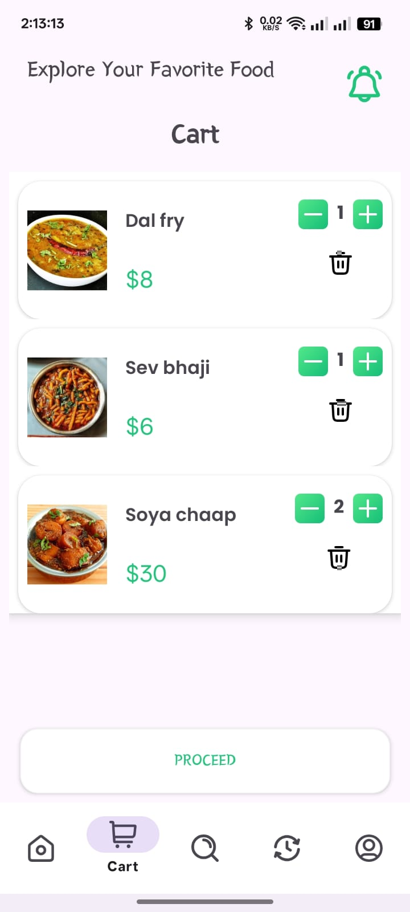

---

## 💳 Checkout Screen

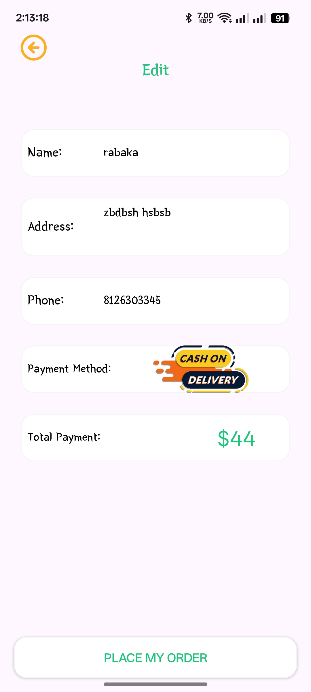

---

## 🎉 Order Placed

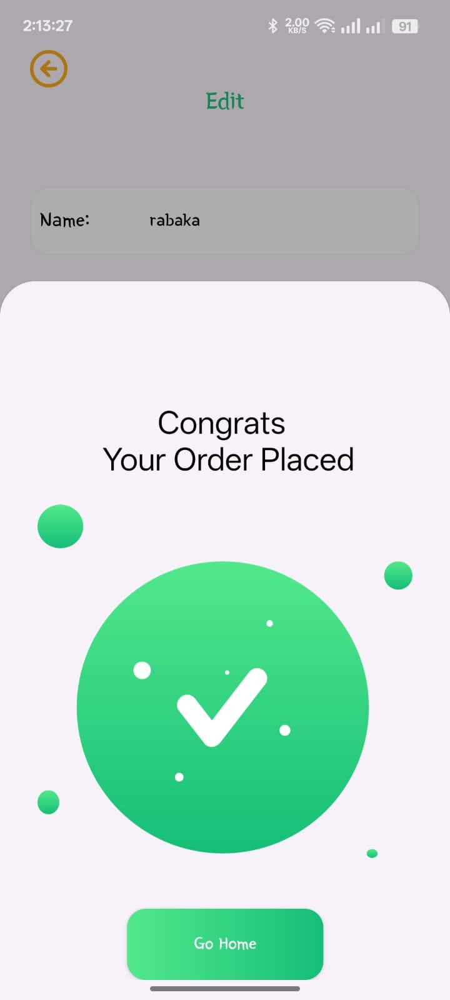

---

## 📜 Order History

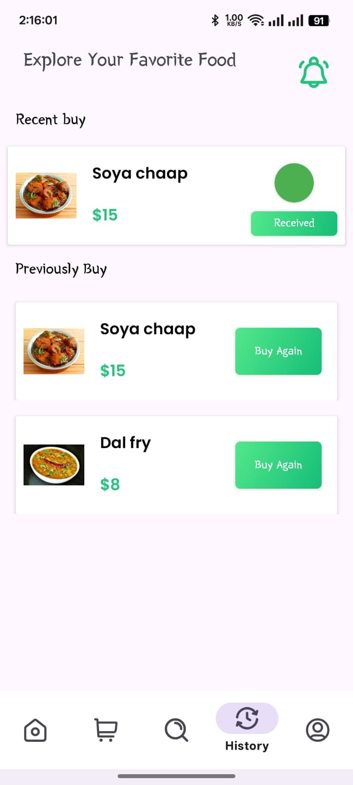

---

## 👤 Profile Screen

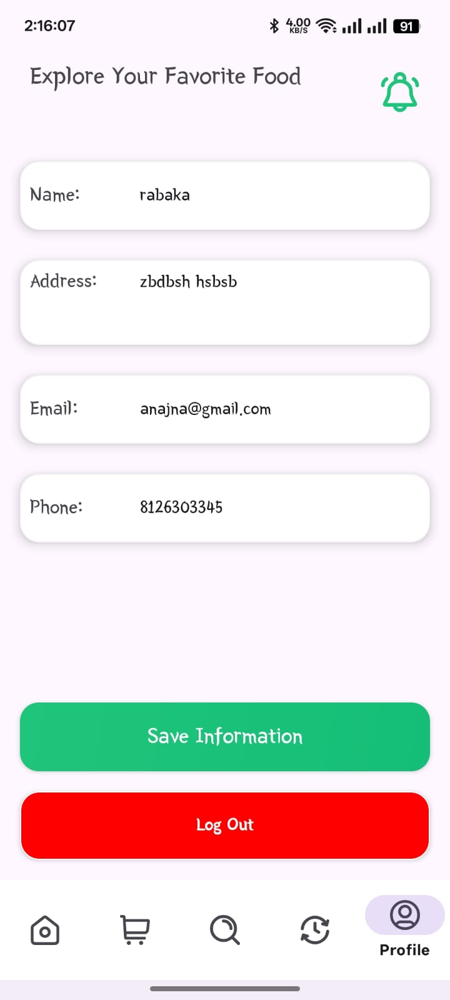

---

## 🏗 MVVM Architecture

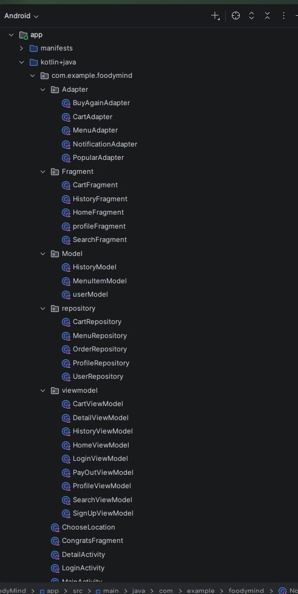

---

# 🚀 Getting Started

## Clone Repository

```bash
git clone https://github.com/amittthakur2156/FoodyMind-User-App.git
```

## Open Project

- Open Android Studio
- Click **Open**
- Select the project folder
- Sync Gradle

---

# 🔥 Firebase Setup

1. Create a Firebase Project
2. Enable Authentication
3. Enable Realtime Database
4. Enable Firebase Storage
5. Download `google-services.json`
6. Place it inside:

```
app/
    google-services.json
```

---

# ▶️ Run the Project

- Connect Android Device or Emulator
- Click **Run ▶**
- Enjoy the App

---

# 📂 Repository

**GitHub Repository**

https://github.com/amittthakur2156/FoodyMind-User-App

---

# 👨‍💻 Developer

## Amit Thakur

Android Developer

- Kotlin
- Firebase
- MVVM Architecture
- Android Studio

---

# 🌟 Future Improvements

- ❤️ Online Payment Gateway
- ❤️ Live Order Tracking
- ❤️ Push Notifications
- ❤️ Dark Mode
- ❤️ Coupons & Offers
- ❤️ Ratings & Reviews
- ❤️ Favorite Foods
- ❤️ AI Food Recommendation

---

# ⭐ Support

If you like this project,

⭐ Star the repository

🍴 Fork the repository

🛠 Contribute to the project

---

# 📜 License

This project is developed for learning, academic, and portfolio purposes.

---

<p align="center">

## 🍔 FoodyMind

### GOOD FOOD, QUICK FOR YOU ❤️

**Made with ❤️ using Kotlin, Firebase & MVVM**

</p>
- ✅ Firebase Storage Images
- ✅ Clean & Scalable Project Structure
